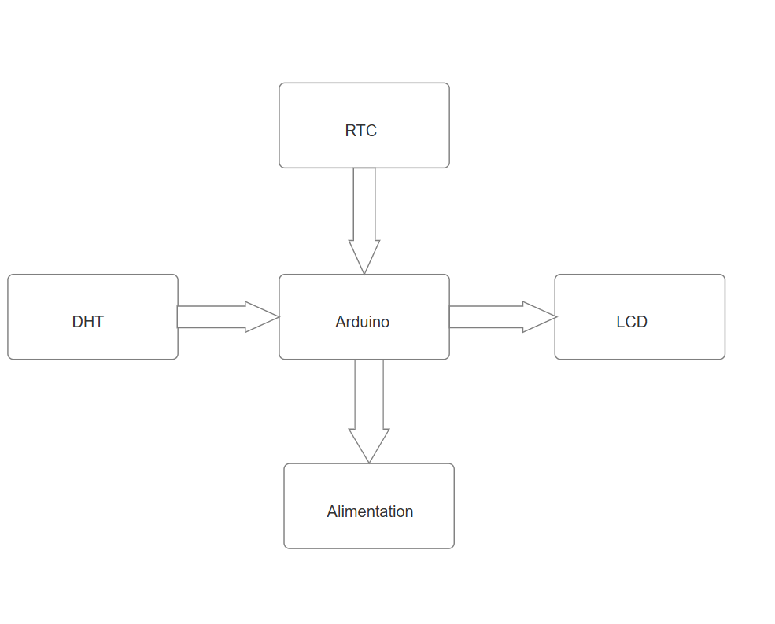
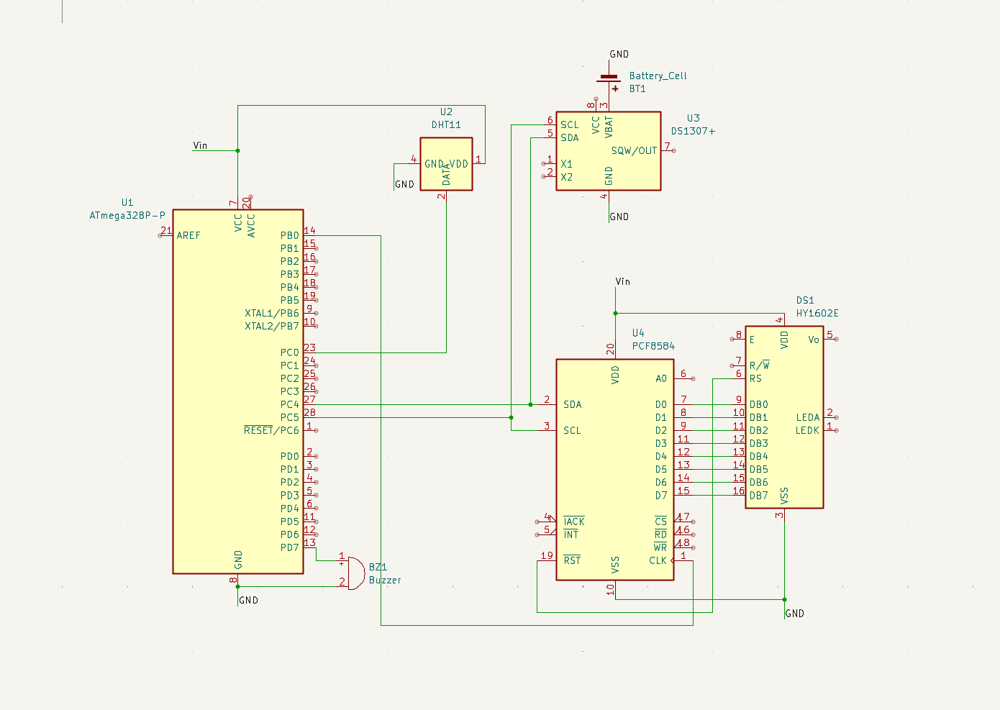

#  Horloge numérique inteligente 

| | |
|-|-|
|`Author` | Ndasso Sarai Eliakim  |

## Description
Ce projet est avant tout une horloge numérique enrichie de fonctionnalités météo. En plus d’afficher l’heure avec précision, elle mesure et affiche en temps réel la température, l’humidité et la luminosité ambiante, le tout sur un écran LCD 1602. Compacte et pratique, cette horloge station météo est pensée pour un usage quotidien à la maison ou au bureau, offrant à la fois l’heure et des données environnementales utiles en un seul appareil.
## Motivation
Je souhaitais créer une horloge personnelle, fonctionnelle et évolutive, tout en apprenant davantage sur l’électronique et la programmation. Plutôt que de me limiter à l’affichage de l’heure, j’ai choisi d’y intégrer des capteurs météo afin de rendre le projet plus complet et pertinent au quotidien. Ce projet me permet de développer des compétences concrètes tout en concevant un objet utile, à la fois informatif et original.
## Architecture

1. **Arduino** :
   - L'Arduino agit comme le cerveau de votre projet, coordonnant les lectures des capteurs, les calculs et l'affichage sur l'écran LCD.

2. **Module RTC (Real Time Clock)** :
   - Ce module permet de garder une heure précise même après une coupure d’alimentation, grâce à sa pile intégrée.
   - Il fournit à l’Arduino l’heure et la date en temps réel via une communication I2C

3. **Capteur DHT (Digital Humidity and Temperature Sensor)** :
   - Ce capteur est utilisé pour mesurer à la fois l'humidité et la température de l'environnement.
   - Il communique avec l'Arduino Nano via une connexion numérique, fournissant des données précises sur l'humidité et la température ambiantes.

4. **Écran LCD 1602** :
   - Cet écran est utilisé pour afficher les données recueillies par les capteurs.
   - Il est connecté à l'Arduino Nano via des broches numériques et est capable d'afficher du texte et des caractères alphanumériques.

### Block diagram

<!-- Make sure the path to the picture is correct -->

### Schematic

### Components

<!-- This is just an example, fill in with your actual components -->

| Device | Usage | Price |
|--------|--------|-------|
| Arduino |  MicroControlleur | [25 RON](https://www.optimusdigital.ro/ro/compatibile-cu-arduino-nano/1686-placa-de-dezvoltare-compatibila-cu-arduino-nano-atmega328p-i-ch340.html?search_query=Arduino+Nano&results=22) |
| Module RTC  | garde le temps | [5 RON](https://www.optimusdigital.ro/ean/others/148-ds1307-real-time-clock-module.html?search_query=time+module&results=369)
| Thermometre  | detecte la temperature | [7 RON](https://www.optimusdigital.ro/ro/senzori-senzori-de-temperatura/584-senzor-de-temperatura-dht11.html?search_query=dht11&results=17) |
| Ecran LCD 1602 avec I2C | Affichage | [17 RON](https://www.optimusdigital.ro/ro/optoelectronice-lcd-uri/2894-lcd-cu-interfata-i2c-si-backlight-albastru.html) |
| Buzzer | Fait le bruit | [1 RON](https://www.optimusdigital.ro/ro/audio-buzzere/634-buzzer-pasiv-de-5-v.html) |
| Fils | fait la connection | [7 RON](https://www.optimusdigital.ro/ro/fire-fire-mufate/884-set-fire-tata-tata-40p-10-cm.html?search_query=set+fire&results=110) |
| Breadboard | Project board | [5 RON](https://www.optimusdigital.ro/ro/prototipare-breadboard-uri/44-breadboard-400-points.html)
| Pile 9v | Garde l'electricite | [5 RON]()

### Libraries

<!-- This is just an example, fill in the table with your actual components -->

| Library | Description | Usage |
|----------|-------------|-------|
| [DHT git](https://github.com/adafruit/DHT-sensor-library) | An Arduino library for the DHT series of low-cost temperature/humidity sensors. | Pour pouvoir utiliser le dht11  |
| [LCD git](https://github.com/blackhack/LCD_I2C/blob/master/src/LCD_I2C.h) | Arduino library to control a 16x2 LCD via an I2C adapter based on PCF8574| Pour pouvoir utiliser l'ecran LCD  |

## code

[code](horloge.ino)

## Log

<!-- write every week your progress here -->

### Week 6 - 12 May

### Week 7 - 19 May

### Week 20 - 26 May

## Reference links

<!-- Fill in with appropriate links and link titles -->

Lien utiles : 

[Article 1](https://forum.arduino.cc/t/printing-a-float-on-16x2-lcd/325305)
[Article 2](https://forum.arduino.cc/t/c-how-to-get-a-degree-sign-on-a-text-lcd-screen/378588)
[Article 3](https://html.alldatasheet.com/html-pdf/1131893/ETC2/GL5528/110/1/GL5528.html)
[Article 4](https://miscircuitos.com/what-are-the-meaning-of-vdd-vss-vcc-vee-and-gnd/)
